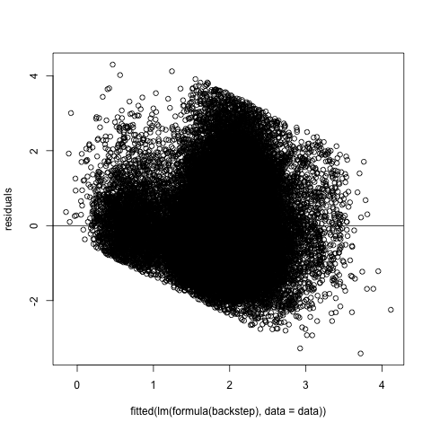
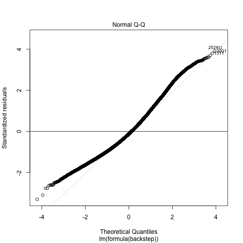

```{r setup, include=FALSE}
knitr::opts_chunk$set(echo = TRUE)
library(tidyverse)
library(broom)
library(knitr)
library(here)
```

```{r load_model_results, include=FALSE}
backstep_tidy <- readRDS("../results/tables/mlr_backstep_tidy.rds")
backstep_glance <- readRDS("../results/tables/mlr_backstep_glance.rds")
backstep_vif <- readRDS("../results/tables/Table3.rds")
```

Our GitHub Repo:
[**LINK HERE**](https://github.com/UBC-MDS/online_news_popularity){.uri}

## Summary

Online articles have become a primary source of news in the digital age. In particular, we are interested in answering two questions: **(i) If the type of news article is associated with the number of shares of online news articles, and (ii) If the day of week a news article is published is associated with the number of shares of online news articles**. In order to answer these questions, we examined factors associated with higher shares per day (log transformed) using a multiple linear regression analysis in a dataset containing 36,644 observations [@online-news]. Our final model, derived using backward model selection, found evidence at 95% confidence level that both type of news article and day of the week of publication are statistically significantly associated with number of shares per day (log transformed), all else equal. In particular, an article shared on the weekend is associated with an increase in the number of shares per day of 26%. Similarly, all categories of news articles, except entertainment news have a positive association with increase in number of shares per day. Our study achieved an adjusted R-squared score of 0.19, implying that additional features that are not among our explanatory variables appear to explain a large portion of variability in shares per day. Future recommendations include collecting data on additional features to boost the model performance.

## Introduction

The online news market space has grown rapidly in recent decades, leading to increased competition between traditional news outlets and non-traditional digital news sources. Understanding the factors associated with popularity of news articles online is vital for guiding publishing strategies of news agencies in order for them to remain competitive in the online news space. Here, we assessed factors associated with online news popularity using a public dataset with statistics from originally published on Mashable (www.mashable.com) in 2015 [@online-news].

In particular, we are interested in answering two questions: 

(i) Is the type of news article (business, entertainment, news, etc.) associated with the number of shares of online news articles, and 

(ii) Is the day of week a news article is published associated with the number of shares of online news articles?

The two questions are inferential in nature since we cannot effective attribute causality since this study does not rely on an experimental design. We are also not attempting any quasi-experimental methods since that is beyond the scope of the content covered thus far in the Data Science Program. Finally, our objective is not to predict the number of shares but to gain an understanding of the relative associations of the type of news article and day of the week on the number of shares in our dataset. 

## Data

The public dataset used for conducting this analysis called "Online News Popularity", and is available on University of California's Machine Learning Repository [@online-news]. It has 36,644 observations (examples) and 61 columns (attributes), summarizing a range of characteristics about articles that were published by Mashable between 1 January, 2013 and 31 December, 2014. Each row represents a news article and includes covariates that are a mix of categorical, text, continuous, and binary features. 

A table with all variables and associated description can be found [here](https://github.com/UBC-MDS/online_news_popularity/blob/main/data/processed/Variable_Information.pdf).

## Methods

#### EDA
During preliminary exploration, we found that of the 61 columns in our dataset, 60 columns were numeric or binary type, and 1 column was text type (url of the article). Furthermore, we found no missing cells in the data. 

As a first exploratory data analysis step, we merged 7 dummy variables for each data channel (namely Entertainment, Business, Lifestyle, Social Media, Tech, World, and Others) into a new categorical variable. This was done to look at how the type of news article, which forms the basis of our research questions, is associated with online news popularity.

Subsequently, we explored data type of the variables in the data set and generated summary statistics for each variable. By creating a correlation plot and a correlation matrix, we tried to identify features that may be most useful for our regression analysis, and eliminated one of the two independent variable pairs that exhibited a high degree of correlation (>0.7 in terms of magnitude). This was done to minimize the presence of multicollinearity. Even though in DSCI 561, we only eliminated one of the variables from the most correlated variable pair, here we went with a more conservative approach of Pearson's correlation of 0.7 as the threshold to drastically reduce biases in coefficient estimates that may stem from multicollinearity. 

As a next step, we explored how number of shares varied based on data channel of the article and on the day of the week through bar plots to unravel any underlying patterns. Finally, we plotted a histogram showing how number of shares vary based on day of the week.

#### Data Cleaning

Upon examining the data during EDA, we observed that the distribution of the variable representing number of shares exhibited significant right-skewness. Furthermore, we observed that articles had been published at different time points prior to data acquisition, which could confound the number of shares attained by each article. To address both of these factors, we created a new feature (Shares / Days since Publication), followed by a log transformation of this new feature. Lastly, outliers in the "log Shares per Day" variable were removed using the Winsorization method, where we defined outliers to be values lower than the 1% percentile and greater than the 99% percentile. Data cleaning was performed using Python [@python] and Pandas [@pandas].

#### Statistical Analysis

A Multiple Linear Regression model was used to understand what factors are associated with online news popularity. The choice of multiple linear regression model is driven by the fact that we want to get a quantitative measure of association between our features of interest and our dependent variable. A linear regression provides feature coefficients, which gives us both magnitude and direction of the association, helping answer our question effectively. 

In particular, the model we are estimating are as follows:

$$log(shares\_per\_day) = \beta_{0} + \beta_{1}*is\_weekend +
\beta_{2}*Entertainment + \beta_{3}*Social Media + $$
$$\beta_{4}*Business + \beta_{5}*Technology + 
\beta_{6}*Lifestyle + \beta_{7}*World + ... +   
\epsilon $$

where the base group for type of news article is Other.

The two hypotheses we are testing are as follows:

All else equal,

**HYPOTHESIS 1:**

$H_0$: The coefficient relating whether or not the news article was released on the weekend and our dependent variable, log_shares_per_day is 0.

$H_1$: The coefficient relating whether or not the news article was released on the weekend and our dependent variable, log_shares_per_day is not 0.

**HYPOTHESIS 2:**

$H_0$: The coefficients relating the type of article (Business, Entertaiment, etc.) and our dependent variable, log_shares_per_day are individually equal to 0.

$H_1$: The coefficients relating the type of article and our dependent variable, log_shares_per_day are individually not equal to 0.

We estimated six versions of this model using “log_shares_per_day” as our dependent variable until we arrived at a regression where all features were statistically significant at the 95% confidence level. In this model, only features that exhibited multicollinearity of less than 0.7 (in terms of magnitude, irrespective of direction) were included. The resulting model was compared to both forward and backward selection models using VIF scores, adjusted R-Squared, and the time taken to run each model to arrive at the best model, which in our case was backward selection model. Finally, we plot the distribution of residuals to visually assess if it follows a normal distribution.

The choice of Adjusted-R-Squared as an evaluation metric for our project is because R-Squared has the advantage in that it defines the degree of variance in the dependent variable that can be explained by the independent variable and is a derivative of MSE. Other metrics such as RMSE or MAE do not not provide a range that will help us in determining how well our model is doing. We have absolute numbers for these other measures, but not a scale. Adjusted R-Squared also accounts for the degrees of freedom in the model. 

The R programming language [@R] and the following R packages were used to perform the statistical analysis outlined in this section: broom [@broom], car [@car], caret [@caret], docopt [@docopt], feather [@feather], here [@here], tidyverse [@tidyverse], knitr [@knitr].

## Results and Discussion
#### EDA
Through exploratory data analysis, we determined that some of the features were not informative to answering our question or contained many missing values. We find out the summary statistics for each variable, the features correlation greater than 0.7 and the distributions of shares vary based on day of the week and topics. The EDA code can be found [here](https://github.com/UBC-MDS/online_news_popularity/blob/main/src/eda.py).

`r params$figure1` shows how number of shares vary based on topic of the article. The category "Others" takes the largest share, followed by "Business" and "Tech". The categories "Entertainment","Lifestyle" and "World" are very close in terms of number of shares, and "Social media" has the smallest number of shares.

```{r topic_distribution_figure, echo=FALSE, fig.cap="Figure 1. Distribution of Shares Based on Topics", out.width = '40%', fig.align = 'center'}
knitr::include_graphics("../results/figures/01_EDA-Bar-Plot-Data-Channel.png")
```

In `r params$figure2`, we have a histogram showing how the distribution of the number of shares. We find that this variable is right skewed and has outliers, which prompted us to transform the variable to log_shares_per_day, as described in the data cleaning section.
```{r shares_distribution, echo=FALSE, fig.cap="Figure 2. Distribution of Shares", out.width = '40%', fig.align = 'center'}
knitr::include_graphics("../results/figures/02_EDA-Shares-Histogram.png")
```

In `r params$figure3`, we present a correlation plot that highlights the strength, direction, and form of the relationship between two features across our dataset. It shows that the kw_avg_avg(Avg. keyword (avg. shares)) has its strongest correlation with shares. The second most correlated feature to shares value is kw_max_max(Best keyword (max. shares)) which quite make sense. 
```{r correlation_features, echo=FALSE, fig.cap="Figure 3. Distribution of Features Correlation Matrix", fig.align='center', out.width = '100%'}
knitr::include_graphics("../results/figures/03_EDA-Correlation-Plot.png")
```

Before model testing, data cleaning was performed to calculate the log_shares_per_day and remove outliers observed in Figure 2. This code can be found [here](https://github.com/UBC-MDS/online_news_popularity/blob/main/src/onp_data_preprocess.py). 

#### Statistical Analysis
The results of our best model, derived from Backward Model Selection are shown in `r params$table1` and `r params$table2`. 

```{r regression_model, echo=FALSE, fig.cap="Table 1. Backward Selection Model Results", fig.align='center', out.width = '100%'}
kable(backstep_tidy, caption = "Table 1. Backstep Model Results")
kable(backstep_glance, caption = "Table 2. Backstep Model Model Performance")
```
The results above found statistically significant evidence at 95% confidence level that both type of news article and day of the week of publication are associated with number of shares per day (log transformed), all else equal. In particular, an article shared on the weekend is associated with an increase in the number of shares per day of 26%. Similarly, all categories of news articles, except entertainment news have a positive association with increase in number of shares per day. 

Overall, our model has an adjusted R-Squared of 0.19. This seems low, particularly given the large number of features included in the model and their statistical significance at alpha = 0.05. This indicates that other variables that are not currently included in the model explain a large portion of the variability in our data. 

We also find that our VIF's for the model are below the threshold of 10 indicating low odds of multicollinearity. This is shown in `r params$table3` below.

```{r vif, echo=FALSE, fig.cap="Table 3. VIF for Backward Selection Model Results", fig.align='center', out.width = '100%'}
kable(backstep_vif, caption = "Table 3. VIF's for Backward Selection Model")
```

Next, we include two plots: `r params$figure4` showing a scatterplot of residuals and `r params$figure5` showing a Q-Q plot of the residuals to assess normality.

```{r residual_fitted, echo=FALSE, fig.cap="Figure 4. Scatterplot of Residuals", fig.align='center', out.width = '50%'}

```

```{r qqplot, echo=FALSE, fig.cap="Figure 5. Q-Q Plot of Residuals", fig.align='center', out.width = '50%'}

```

Finally, in `r params$figure6`, we plot a distribution of the residuals, which looks normally distributed, one of the assumptions of a linear regression.

```{r residual_normality_plot, echo=FALSE, fig.cap="Figure 6. Histogram of Residuals", fig.align='center', out.width = '50%'}
knitr::include_graphics("../results/figures/Figure_3.png")
```

## Limitations

Our main limitation in this project is a limited number of relevant features, since the current set of non-correlated features only explain about 19% of the variation in online news popularity. Furthermore, while we are able to come up with association, it is difficult to attribute causality for which quasi-experimental methods will be needed.

## Summary

In this study, we tried answering two questions: 

(i) If the type of news article is associated with the number of shares of online news articles, and 

(ii) If the day of week a news article is published is associated with the number of shares of online news articles. 

We looked at factors associated with higher shares per day (log transformed) using a multiple linear regression analysis using Online News Popularity dataset [@online-news]. The best results from backward model selection, found evidence at 95% confidence level that both type of news article and day of the week of publication are statistically significantly associated with number of shares per day (log transformed), all else equal. In particular, an article shared on the weekend is associated with an increase in the number of shares per day of 26%. Similarly, all categories of news articles, except entertainment news have a positive association with increase in number of shares per day. Our study achieved an adjusted R-squared score of 0.19, implying that additional features that are not among our explanatory variables appear to explain a large portion of variability in shares per day. 

## Future Direction

As next steps, we must:

1.	Compare and contrast feature importance derived by other parametric supervised learning models.
2.	Conduct analysis on other online news popularity datasets to see if our results are unique to Mashable or extends to others, such as [News Popularity in Multiple Social Media Platforms](https://www.kaggle.com/nikhiljohnk/news-popularity-in-multiple-social-media-platforms).
3. Explore the use of quasi-experimental methods to switch gears from association to causation.

## References
