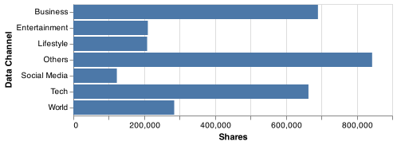
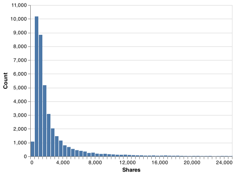
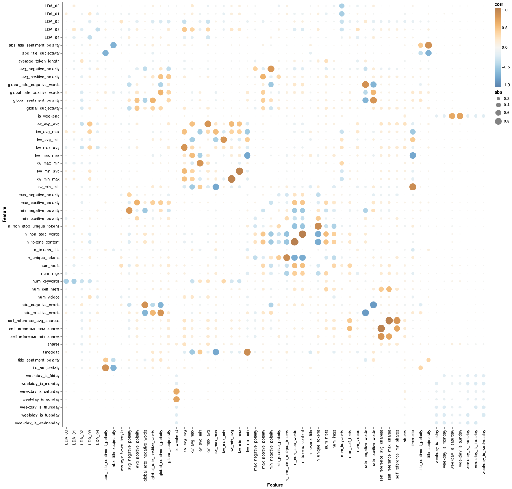
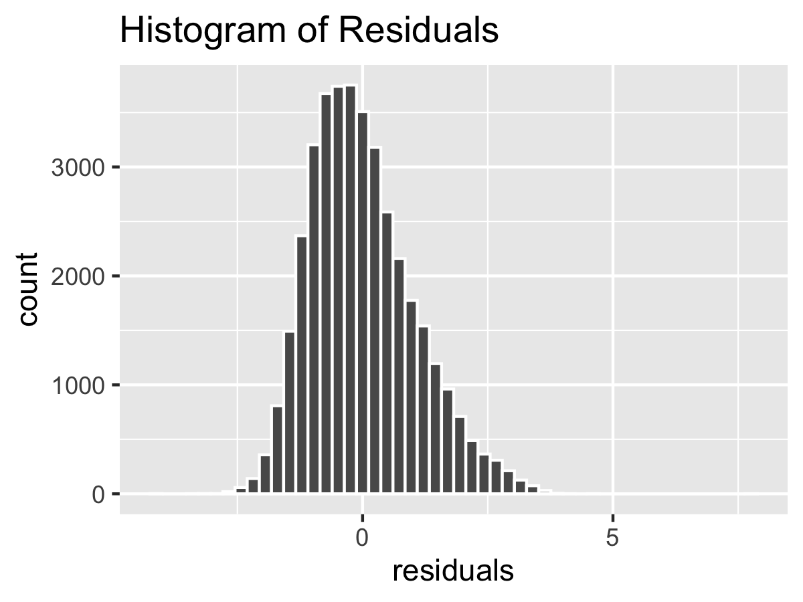

```{r setup, include=FALSE}
knitr::opts_chunk$set(echo = TRUE)
library(tidyverse)
library(broom)
library(knitr)
library(here)

```

```{r load_model_results, include=FALSE}
backstep_tidy <- readRDS("../results/tables/mlr_backstep_tidy.rds")
backstep_glance <- readRDS("../results/tables/mlr_backstep_glance.rds")
```

Our GitHub Repo:
[**LINK HERE**](https://github.com/UBC-MDS/online_news_popularity){.uri}

## Summary

Online articles have become a primary source of news in the digital age. In order to understand factors associated with online news popularity, we examined factors associated with higher shares per day (log transformed) using a multiple linear regression analysis in a dataset containing 36,644 observations [@online-news]. Our final model, derived using backward model selection, achieved an R-squared score of 0.2132. Additional features that are not among our explanatory variables appear to explain a large portion of variability in the shares per day. Further analysis will be required to better understand the factors which associate with online news popularity.

## Introduction

The online news market space has grown rapidly in recent decades, leading to increased competition between traditional news outlets and non-traditional digital news sources. Understanding the factors associated with popularity of news articles online is vital for guiding publishing strategies of news agencies in order for them to remain competitive in the online news space. Here, we assessed factors associated with online news popularity using a public dataset with statistics from originally published on Mashable (www.mashable.com) in 2015 [@online-news].


## Methods

#### EDA
During EDA on the raw data, we try merging data channels and the weekday columns into one column, then explore data type of the variables in the data set and summary Statistics for each variable. By creating correlation plot and correlation matrix, we try to find out the important features and in the end, we explore bar graph showing how number of shares vary based on topic, how number of shares vary based on day of the week, and try histogram showing how number of shares vary based on day of the week. Finally we made the matrix to pick the features whose coefficient is larger than 0.7.  The code used to perform the 2 versions EDA can be found [here](https://github.com/UBC-MDS/online_news_popularity/tree/main/src).

#### Data Cleaning

Upon examining the data during EDA, we observed that the distribution of the response variable Shares was highly right-skewed.
Furthermore, we observed that articles had been published at different time points prior to data acquisition,
which could confound the number of shares attained per article. To address both of these factors, we transformed the data by 
creating a Shares per Day features (Shares / Days since Publication), followed by a performing a log transformation of Shares per Day.
Lastly, outliers in the log Shares per Day were removed using the Winsorization method, where we defined outliers to be values 
lower than the 1% percentile and greater than the 99% percentile. Data cleaning was performed using Python [@python] and Pandas [@pandas].

#### Statistical Analysis

A Multiple Linear Regression model was used to understand what factors are associated with online news popularity. We estimated six versions of this model using “log_shares_per_day” as our dependent variable until we arrived at a regression where all features were statistically significant at the 95% confidence level. This was compared to both forward and backward selection models using VIF scores, R-Squared, and the time taken to run each model to arrive at the best model, which in our case was backward selection model. Finally, we plot the distribution of residuals to visually assess if it follows a normal distribution.

The R programming language [@R] and the following R packages were used to perform the statistical analysis outlined in this section: broom [@broom], car [@car], docopt [@docopt], tidyverse [@tidyverse].

## Results and Discussion
#### EDA
Through exploratory data analysis, we determined that some of the features were not informative to answering our question or contained many missing values. We find out the summary statistics for each variable, the features correlation greater than 0.7 and the distributions of shares vary based on day of the week and topics. 2 versions of EDA code can be found [here](https://github.com/UBC-MDS/group29/blob/main/results/EDA_First_Attempt.ipynb) and [here](https://github.com/UBC-MDS/group29/blob/main/results/EDA_initial.ipynb).

Bar graph showing how number of shares vary based on topic. Several of the topics were reviewed by plotting the distribution of the shares based on different topic, Except others, "Business" and "Tech" take the largest 2 shares. The shares left "Entertainment","Lifestyle" and "World" takes almost equal shares, and "Social media" takes the smallest shares.
```{r topic_distribution_figure, echo=FALSE, fig.cap="Figure 1. Distribution of Shares Based on Topics", out.width = '40%', fig.align = 'center'}

```

Histogram showing how number of shares vary based on day of the week. Several of the weekdays were reviewed by plotting the distribution of the shares based on different weekdays, Except others, "Wednesday", "Monday" and "Saturday" take the largest 3 shares. The "Tuesday","Friday" and "Thursday" takes almost equal shares, and "Sunday" takes the smallest shares.
```{r shares_distribution, echo=FALSE, fig.cap="Figure 2. Distribution of Shares", out.width = '40%', fig.align = 'center'}

```

Correlation plot showing the strength, direction, and form of the relationship between 2 features. It shows the kw_avg_avg(Avg. keyword (avg. shares)) has its strongest correlation with shares. The second most correlated feature to shares value is kw_max_max(Best keyword (max. shares)) which quite make sense. 
```{r correlation_features, echo=FALSE, fig.cap="Figure 3. Distribution of Features Correlation Matrix", fig.align='center', out.width = '100%'}

```

Before model testing, data cleaning was done to address the findings of  non-informative features, class imbalance, NAN values. And we calculate the shares_per_day and remove outliers, this code can be found  [here](https://github.com/UBC-MDS/online_news_popularity/blob/main/src/onp_data_preprocess.py). 

#### Statistical Analysis
The results of our best model, derived from Backward Model Selection is shown below: 
```{r regression_model, echo=FALSE, fig.cap="Table 1. Backward Selection Model Results", fig.align='center', out.width = '100%'}
kable(backstep_tidy, caption = "Table 1. Backstep Model Results")
kable(backstep_glance, caption = "Table 2. Backstep Model Model Performance")
```
Overall, our model has an R-Squared of 0.2051. This seems like a low R-Squared, particularly given the large number of features included in the model and their statistical significance at alpha = 0.05. This indicates that other variables that are not currently included in the model explain a large portion of the variability in our data. There is not much we can do about this problem, beyond including some interaction variables to assess if there are any interaction effects.

Finally, we plot a distribution of the residuals, which looks normally distributed, one of the assumptions of a linear regression.

```{r residual_normality_plot, echo=FALSE, fig.cap="Figure 4. Histogram of Residuals", fig.align='center', out.width = '50%'}

```
As next steps, we need to consider if interaction terms can help improve model performance, and perform rigorous statistical tests for the remaining assumptions of a multiple linear regression model – heteroscedasticity and normality of residuals.

## References
